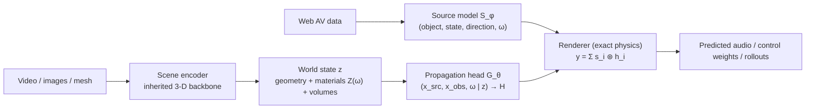

# Architecture: an acoustics foundation model

**Working name: GREEN** — General Rendering Engine for Environmental acoustics. The product is a learned Green's function.

This document captures what we're building, why, how it's trained, and what will try to kill it. It assumes a math/CS reader; physics is introduced as needed with references.

## 1. Thesis

Every microphone signal on Earth has the form

```
y(t) = Σ_i  s_i(t) ⊛ h_i(t)  +  noise
```

— source signals convolved with propagation filters. The propagation filters are samples of the scene's **Green's function**, the complete description of how sound moves through that environment. Nobody has built the model that factorizes the world this way.

We build a foundation model that maps **(scene, source position, listener position, frequency) → transfer function**, trained on simulation at scale, calibrated with purpose-built field captures, and enriched with web-scale audio-visual data. The model is used in both directions:

- **Forward (render/predict)**: what will this leaf blower sound like at my window? Roll a scene forward in time.
- **Inverse (control/sense)**: what should these speakers emit to cancel it, or to deliver private audio to one person? What does this echo imply about the scene?

The direct precedent is [Arena Physica](https://www.arenaphysica.com/) in electromagnetics: their Heaviside-0 model, trained on ~3M designs and 20+ years of simulation compute, predicts EM behavior ~800,000× faster than commercial solvers ([Atlas RF Studio](https://www.arenaphysica.com/publications/rf-studio)). Acoustics shares the math (linear wave equations) with better economics: sound is ~6 orders of magnitude slower than light (millisecond inference fits inside real-time control loops), and the sensors/actuators cost dollars, not lab equipment.

## 2. Physics background (the objects we compute with)

### 2.1 Wave equation → Helmholtz

Sound is small pressure fluctuation p(x,t) obeying `∂²p/∂t² = c²∇²p`. Because the equation is linear and time-invariant (LTI), the Fourier transform in time decouples frequencies: assuming `p = Re[P(x)e^{iωt}]` gives the **Helmholtz equation**

```
∇²P + k²P = 0,   k = ω/c
```

one independent problem per frequency. Helmholtz is the eigenvalue problem of the Laplacian; room modes are its eigenfunctions, and modal density grows like f² (Weyl's law) — which matters later.

### 2.2 Green's function

`G(x_src, x_obs, ω)` is the field at x_obs from a unit point source at x_src: the solution of `(∇² + k²)G = −δ(x − x_src)`. By superposition, any field is an integral of sources against G — so G is the master object; knowing it means never solving the PDE again. CS framing: view the Helmholtz operator as a huge matrix A; G is the kernel of A⁻¹. Reciprocity `G(a,b) = G(b,a)` is "the inverse of a symmetric operator is symmetric," and is practically valuable (measure with a walking mic, learn the walking-speaker case for free).

Free space has closed forms (`e^{−ikr}/4πr` in 3-D). Any scene with boundaries does not — G soaks up every reflection and diffraction. **G is the scene.**

### 2.3 Transfer matrix

Sampling G at N speaker positions × M listener positions gives `H(ω) ∈ C^{M×N}`, the **transfer matrix**: `p = Hq`. Its size scales with ports and frequency bins (bins needed ≈ bandwidth × reverb time, since the frequency response decorrelates every ~1/T60), *not* with scene complexity. Rows spaced closer than λ/2 are nearly linearly dependent — rank saturates at the scene's physical degrees of freedom.

Given H, both control problems are small regularized least squares:

- **Silence**: min_w ‖P + Hw‖² (P = noise field at control points)
- **Directed audio**: min_w ‖Hw − d‖² (d = desired field: loud here, silent there)

Classical alternatives when full solves aren't needed: delay-and-sum beamforming; **time reversal** (drive with Hᴴ — refocuses through clutter; Fink 1992); and the **parametric array** for directed audio from small apertures (Westervelt 1963), commercialized as the "audio spotlight."

### 2.4 Impedance: the material parameter

A boundary's entire acoustic identity is its **specific impedance** `Z(ω) = pressure / normal particle velocity` at the surface — the acoustic Ohm's law (complex: real part = dissipation, imaginary = stored energy/phase). Reflection is set by mismatch with air's characteristic impedance ρc:

```
R = (Z − ρc) / (Z + ρc)
```

Rigid wall Z→∞ (R=+1), open window Z→0 (R=−1), matched Z=ρc (R=0, perfect absorption — absorbers are impedance-matching devices). The tabulated "absorption coefficient" α = 1 − |R|² is Z with the phase discarded. Caveat: pointwise Z assumes **locally-reacting** surfaces; thick porous layers and resonant panels where sound travels inside the structure need a richer boundary description (fine for v1 to ignore).

**Geometry + Z(ω) on every surface fully determines G** — but extracting G is a *solve*, not an integral: surfaces re-scatter to each other, so surface responses are globally coupled (like knowing every resistor but still having to solve the circuit; the bounce series direct + 1-bounce + 2-bounce + … sums to an operator inverse (I−R)⁻¹). Standard solvers: FDTD (time-march), BEM (boundary integral equation; Kirchhoff–Helmholtz machinery), image-source/ray methods at high frequency (Allen & Berkley 1979). **The foundation model's propagation head is a learned amortization of this solve.**

### 2.5 Volumetric media (trees, foliage)

Foliage breaks the surface-impedance abstraction and gets its own: an **effective participating medium** (like fog in graphics) with bulk parameters — extinction, scattering albedo, anisotropy — per frequency. Physics is merciful: scattering off sub-wavelength objects is Rayleigh-weak (amplitude ∝ (size/λ)²), so canopies are nearly transparent below ~500 Hz and only become strong diffuse scatterers at kHz; measured foliage attenuation is a few dB per 10 m at high frequency (ground absorption under trees often dominates — see Attenborough, *Predicting Outdoor Sound*; ISO 9613-2). Wind-shaken leaves decohere the high band on sub-second timescales — which lands in the band of the model that is statistical anyway (§3.2).

So the material vocabulary has two entry types: `surface → Z(ω)` and `volume → (extinction, albedo)(ω)`. Note the pleasing alignment with scene representations: meshes carry surfaces; splat-style volumetric blobs (which is what a tree looks like in a Gaussian splat) carry volumes.

## 3. The model



### 3.1 Three modules + an exact renderer

1. **Scene encoder** — video/images (+ mesh) → metrically-scaled latent world state. **Inherited, not built**: start from an open 3-D/video world-model backbone (NVIDIA [Cosmos](https://github.com/nvidia/cosmos), splat/mesh reconstruction stacks; NeRF → 3DGS lineage: Mildenhall et al. 2020, Kerbl et al. 2023). Vision solved geometry; we free-ride. The one genuinely new head: **appearance → acoustic materials** (Z(ω) per surface, volumetric parameters per medium), predicted *with uncertainty* — appearance correlates with but does not determine impedance (painted brick vs. painted drywall), so the distribution is collapsed by in-situ measurement when available.
2. **Propagation head `G_θ`** — the crown jewel: (x_src, x_obs, ω | z) → complex transfer function. This is the cross-scene generalization of per-scene "neural acoustic fields" (Luo et al., NeurIPS 2022; acoustic volume rendering [arXiv:2411.06307](https://arxiv.org/abs/2411.06307); neural acoustic context fields [arXiv:2309.15977](https://arxiv.org/abs/2309.15977); geometry-conditioned RIR prediction [arXiv:2504.14409](https://arxiv.org/abs/2504.14409); material-conditioned RIR generation [arXiv:2604.21119](https://arxiv.org/abs/2604.21119); survey: [arXiv:2504.16289](https://arxiv.org/abs/2504.16289)).
3. **Source model `S_φ`** — an emission library: (object identity, operating state, direction, ω) → emitted spectrum + **directivity** (sources are not monopoles; front/back of a leaf blower differs ~10 dB). The taxonomy of loud objects is small (blowers, saws, traffic classes, HVAC, voices), heavily represented on video platforms, and mostly quasi-stationary or periodic — compact frequency-domain descriptions (envelope + harmonic comb + modulation statistics) suffice. Condition on *visual* state (RPM, throttle, gait) so the model predicts sound from watching.

The **renderer is not learned**: `y = Σ s_i ⊛ h_i` is exact, cheap, differentiable physics. All learning pressure lands on the two things worth learning. This also gives the self-supervision loop (§5.3).

### 3.2 The band split (honest parameterization of what's knowable)

Output representation differs by frequency band, mirroring physics rather than fighting it:

- **Low band** (below the scene's Schroeder-type cutoff, ~200–1000 Hz depending on scene size; Schroeder 1962): full **complex** transfer function — deterministic magnitude and phase. This is where control lives and where phase is physically stable.
- **High band**: phase is chaotic — modal density grows like f² and responses are sensitive to mm-scale geometry and ~1 °C temperature drift. Unlearnable *in principle*, not just hard. Predict the stable statistics instead: energy decay per band, direct-to-reverberant ratio, early-reflection structure, coherence, decoherence rates. Perception, design, and regulation consume exactly these; nothing can use high-band phase because nothing can know it.

The crossover region (λ comparable to furniture/branch/crown scales) is where classical abstractions are weakest and the learned model should earn the most.

### 3.3 Rollout: two timescales, never autoregress waveforms

Scene state (positions, source operating states) evolves at ~10 Hz; audio rides on top at 48 kHz *through the LTI machinery*. Rolling a scene forward = advance the slow state, re-evaluate H along source/listener trajectories (cheap model queries), overlap-add convolution for waveforms. Moving sources are a *path through the Green's field*, not a new modality. This is deliberately unlike Sora-class joint AV generation, which autoregresses in pixel/audio-token space and demonstrably degrades on cross-modal physical consistency ([arXiv:2605.07061](https://arxiv.org/abs/2605.07061)).

## 4. Use cases

Requirements differ sharply: **control needs phase; perception needs statistics.** Ranked by nearness:

- **Machine/infrastructure health monitoring** (statistics): universal "sounds wrong for its geometry" detector for bridges, pipelines, turbines, HVAC.
- **Design-time inverse acoustics** (surrogate speed): quiet drones/eVTOLs, appliances, barriers, metamaterial panels — noise as a differentiable design objective; the direct Arena analog.
- **Adaptive ANC with learned priors** (low-band phase): car cabins, aircraft, active windows, machinery enclosures. Classical adaptive control (FxLMS; Nelson & Elliott, *Active Control of Sound*, 1992) with the scene model replacing per-install hand-tuning.
- **Personal sound zones / directed audio** (low-band phase): per-seat audio, quiet zones tracking a person (Betlehem et al., IEEE SPM 2015). Demonstrated in our own 2-D sim: a 2 m tracked quiet zone at −28 to −50 dB, re-solved instantly from a calibrated model as the target moves.
- **AR/spatial audio & software-defined rooms** (statistics + geometry): virtual sources that occlude and reverberate correctly; active acoustics commoditized.
- **Hearing aids / cocktail-party** (statistics + array processing): scene-aware separation.
- **Sensing inverses** (varies): sonar-like mapping from phones, search & rescue, structural echo-imaging; ultrasound (same math) long-term.

Anti-use-case: blanket-silencing broadband high-frequency noise in open air — blocked by theorems (§6.1), not engineering.

Dual-use note: the sensing inverse generalizes eavesdropping-shaped capabilities (vibration-as-microphone); access control around those queries is a governance question to take seriously.

## 5. Data strategy

Three tiers; the key insight is that **only phase-accurate supervision teaches propagation, and only two tiers have it.**

### 5.1 Tier 1 — simulation, in bulk

FDTD/BEM solves over procedurally generated and *generated-world* scenes with randomized material assignments → millions of (scene, Z-map, G) triples. Generated 3-D worlds are now exportable at scale: [Marble](https://www.worldlabs.ai/blog/marble-world-model) exports Gaussian splats (PLY) *plus collider/high-quality meshes (GLB)* — the mesh is the load-bearing artifact for us — and open alternatives exist ([HY-World 2.0](https://github.com/Tencent-Hunyuan/HY-World-2.0), HunyuanWorld). Pipeline caveats (each a required stage): **metric scale calibration** (generated scenes are up-to-scale; acoustics is absolutely scale-sensitive), **watertight repair** (a 5 cm hole is invisible to a rasterizer and a highway for sound), **material assignment** (initially randomized/heuristic; later from the appearance→impedance head, closing a loop).

Also in tier 1: our existing validated 2-D FDTD lab (see `simulation_lessons.md`) as the fast test harness for solver correctness and control-loop evals.

### 5.2 Tier 2 — field rigs (the moat)

Teams walk instrumented rigs (~$3–5k: cameras + SLAM/IMU, rigid 16–32-channel calibrated mic array, and a **probe speaker**) through real environments. Three supervision streams per walk:

1. **Active sine sweeps → absolute G** at cm-accurate poses (exponential sweep deconvolution is standard and exact). The scarce, priceless label — published RIR corpora cover only hundreds of rooms (cf. Meta's Real Acoustic Fields, CVPR 2024; [SoundSpaces](https://soundspaces.org/) in simulation).
2. **Passive multi-mic → relative transfer functions.** The trick that makes passive recordings rigorous: with M mics, the *ratios between channels* are observable **without knowing the source signal** (the unknown source cancels; Gannot et al. 2001). Every leaf blower that wanders past the rig becomes free propagation supervision; TDOA localizes it; known array geometry constrains G_θ directly. This dissolves the blind-deconvolution objection to found audio — but only for *our* rigs, where the array is calibrated and geometry known.
3. **(appearance, measured Z) pairs** — the sweep tells you the absorption behind each visible surface; the camera tells you what it looks like. This dataset (the input to the material head) does not exist anywhere today.

Outdoor phase data goes stale in minutes (temperature drift ~0.6 m/s per °C, wind advection/turbulence) — collect outdoor tiers for statistics; the rig's job outdoors is decay/coherence measurement, not phase maps.

### 5.3 Tier 3 — web-scale AV data (priors, never propagation)

YouTube-class video: source library (emission spectra + visual-state conditioning), semantics, coarse reverb statistics (blind RT60/DRR estimation), AV event timing. Never propagation: consumer capture chains are adversarial to physics — AGC is a time-varying nonlinearity (breaks LTI outright), noise suppression deletes the reverb tail, lossy codecs discard phase. Use as auxiliary losses and for `S_φ`, with rig recordings of the same object classes providing absolute calibration. Relevant representation-learning context: spatial audio SSL is just emerging ([GRAM, arXiv:2506.00934](https://arxiv.org/abs/2506.00934); [WavJEPA, arXiv:2509.23238](https://arxiv.org/abs/2509.23238)).

### 5.4 Training curriculum

1. **Sim pretraining** of `G_θ`. Gate: beat classical baselines — wave-kernel Gaussian-process interpolation (kernel = Helmholtz correlation, J₀/sinc; Ueno, Koyama & Saruwatari 2018) and image-source fits — on held-out scenes. A network that can't beat these hasn't earned its parameters.
2. **Sim2real fine-tune** on sweep data, with learned per-device calibration tokens (mic/speaker responses as latents, so hardware variance stops being noise).
3. **Analysis-by-synthesis at scale**: on passive rig data, jointly infer sources and propagation to reconstruct all M channels through the exact renderer; reconstruction error trains everything end-to-end.
4. **Source model** from tier 3, grounded by tier-2 recordings at known distances.

## 6. Challenges

### 6.1 Physics walls (theorems — respect, don't fight)

The one positive theorem first: **Kirchhoff–Helmholtz** — a continuous monopole+dipole layer on a closed surface can zero the exterior field exactly; perfect anti-sound is *legal*, and every practical limit is a correction term. The walls:

- **λ/2 sampling**: array spacing must be ≤ λ/2 for coherent control (verified in sim: improvement stops exactly at the Nyquist count).
- **Quiet-zone size ∝ λ**: ~λ/10–λ/4 usable diameter.
- **Causality**: unpredictable broadband noise can't be cancelled at a distance; the loophole is *periodic/learned* sources (delays wrap mod the period) — load-bearing for most products.
- **Energy redistribution**: monopole zone control mostly redistributes sound; our sim shows a −20 dB tracked zone making most other locations louder. Only closed-surround geometries reduce net radiated power.
- **Dead frequencies**: uniformly driven rings can't radiate when kR hits a J₀ zero (interior resonance); non-uniform weights dodge it (verified in sim).
- **Modal chaos above Schroeder**: high-band phase is unknowable (§3.2).
- **Time variance**: cancellation depth ≈ −20·log₁₀(channel error); 10° phase error caps ~15 dB. Outdoors, turbulence sets a coherence time (0.1–10 s), so **the model's job is to make re-measurement cheap, not to be right forever** — strong priors mean a couple of probe chirps re-lock H from a few coefficients.

### 6.2 Engineering challenges

- **Materials gap**: appearance underdetermines impedance; mitigations are uncertainty-aware prediction + cheap in-situ sweeps + the tier-2 (appearance, Z) dataset.
- **Sim2real**: solver idealizations (locally-reacting surfaces, missing volumetric media, mesh errors) vs. reality; tier 2 exists to close this.
- **Scene representation seams**: surfaces (mesh + Z) vs. volumes (splats + effective media) need a unified interface for the solver and the learned head.
- **Hardware variance**: every mic/speaker is a filter; learned calibration tokens + occasional lab characterization.
- **Evaluation doesn't exist yet**: no accepted benchmark for acoustic physical accuracy (first stabs: [arXiv:2605.07061](https://arxiv.org/abs/2605.07061)). We must build it — and owning the benchmark is half the moat.

## 7. Evaluation

- **Held-out sweep prediction**: low-band complex error (magnitude + phase), high-band decay/DRR/coherence error; sliced by scene type, distance, band.
- **Closed-loop control (the metric that matters)**: use predicted H to compute cancellation/focusing weights; measure achieved null depth, first in sim, then on a physical speaker array. Physics converts model error into decibels customers feel (−20·log₁₀(ε)).
- **Rollout consistency**: predicted vs. recorded audio along rig trajectories.
- **Source prediction**: video of an object → predicted sound at distance, scored spectrally and perceptually.
- **Baselines to beat**: wave-kernel GP interpolation, image-source models, per-scene NAFs.

## 8. Relationship to the world-model landscape

World Labs splits world models into [renderer / simulator / planner](https://www.techtimes.com/articles/317927/20260606/feifei-lis-world-labs-splits-world-model-three-types-marble-targets-simulation-linchpin.htm). Applied to sound: acoustic *renderers* exist (Foley/V2A models — semantically rich, physically shallow); the acoustic *simulator* (this project: state a program can compute on — H) is unclaimed; the acoustic *planner* (control solves) is easy once the simulator exists. NeRF and Gaussian splatting are scene *representations* — the state half of a world model with no transition function — and neural acoustic fields are literally NeRF's acoustic twin (radiance L(x,d) ↔ Green's G(x_src,x_obs,ω)). Our integration bets: inherit scene encoders from open world models ([Cosmos](https://github.com/nvidia/cosmos), [HY-World 2.0](https://github.com/Tencent-Hunyuan/HY-World-2.0)); use generative 3-D worlds as tier-1 scene factories; and feed acoustic sensing *back* into the shared world state (sound diffracts around corners cameras can't see) — the bidirectionality that makes it a genuine multimodal world model rather than an audio skin.

## 9. Milestones

1. **M1 (sim-only)**: `G_θ` beats GP/image-source baselines cross-scene. De-risks architecture at zero field cost.
2. **M2 (rooms)**: predict RIRs at unvisited positions in *unvisited rooms* from video alone, within a few dB low-band — the "NeRF moment" for acoustics.
3. **M3 (outdoors, quasi-static)**: streets/sites in calm conditions; statistical bands verified under wind.
4. **M4 (the demo)**: phone video of a street → predict the leaf blower at your window → compute speaker weights → hardware null, measured before/after dB.

## 10. References

Physics & classical methods

- Nelson, P. & Elliott, S. *Active Control of Sound*. Academic Press, 1992. (FxLMS-era ANC bible)
- Allen, J. & Berkley, D. "Image method for efficiently simulating small-room acoustics." JASA, 1979.
- Fink, M. "Time reversal of ultrasonic fields." IEEE Trans. UFFC, 1992.
- Westervelt, P. "Parametric acoustic array." JASA, 1963. (basis of the "audio spotlight")
- Schroeder, M. "Frequency-correlation functions of frequency responses in rooms." JASA, 1962. (Schroeder frequency / modal chaos)
- Betlehem, T. et al. "Personal sound zones." IEEE Signal Processing Magazine, 2015.
- Gannot, S. et al. "Signal enhancement using beamforming and nonstationarity..." IEEE Trans. SP, 2001. (relative transfer functions)
- Ueno, N., Koyama, S., Saruwatari, H. "Kernel ridge regression with constraint of Helmholtz equation..." (sound-field interpolation with wave kernels), 2018.
- Attenborough, K. et al. *Predicting Outdoor Sound*. Taylor & Francis. ISO 9613-2 for outdoor attenuation engineering practice.

Neural fields & acoustic learning

- Mildenhall, B. et al. "NeRF." ECCV 2020. Kerbl, B. et al. "3D Gaussian Splatting." SIGGRAPH 2023.
- Luo, A. et al. "Learning Neural Acoustic Fields." NeurIPS 2022.
- Acoustic volume rendering for impulse response fields: [arXiv:2411.06307](https://arxiv.org/abs/2411.06307)
- Neural acoustic context fields: [arXiv:2309.15977](https://arxiv.org/abs/2309.15977)
- Geometry-conditioned RIR prediction with pretraining: [arXiv:2504.14409](https://arxiv.org/abs/2504.14409)
- Material-conditioned RIR generation: [arXiv:2604.21119](https://arxiv.org/abs/2604.21119)
- Few-shot novel-view RIR prediction: [arXiv:2605.28101](https://arxiv.org/abs/2605.28101)
- RIR prediction with perceptual validation: [arXiv:2509.24834](https://arxiv.org/abs/2509.24834)
- Survey of data-driven room acoustics: [arXiv:2504.16289](https://arxiv.org/abs/2504.16289)
- SoundSpaces (audio-visual simulation platform): https://soundspaces.org/ ; Real Acoustic Fields dataset (Meta), CVPR 2024.

Representations & world models

- NVIDIA Cosmos (open world foundation models for physical AI): https://github.com/nvidia/cosmos ; Cosmos 3: [arXiv:2606.02800](https://arxiv.org/abs/2606.02800)
- World Labs Marble (multimodal world model; splat + mesh export): https://www.worldlabs.ai/blog/marble-world-model
- Tencent HY-World 2.0 (open): https://github.com/Tencent-Hunyuan/HY-World-2.0
- Marble → Isaac Sim robotics workflow: https://developer.nvidia.com/blog/simulate-robotic-environments-faster-with-nvidia-isaac-sim-and-world-labs-marble/

Audio representation & generation context

- GRAM (spatial audio SSL): [arXiv:2506.00934](https://arxiv.org/abs/2506.00934); WavJEPA: [arXiv:2509.23238](https://arxiv.org/abs/2509.23238)
- "Do Joint Audio-Video Generation Models Understand Physics?": [arXiv:2605.07061](https://arxiv.org/abs/2605.07061)
- Arena Physica / Atlas RF Studio (EM precedent): https://www.arenaphysica.com/publications/rf-studio

Internal evidence

- 2-D FDTD Anti-Noise Field Lab (interactive): https://claude.ai/code/artifact/bc04d89a-a64c-4788-9e2d-f63272bcc13c — whole-exterior cancellation to −52 dB (offline probes), tracked 2 m quiet zone at −28 to −50 dB with instant re-solve from a calibrated model; validated numbers and solver gotchas in `simulation_lessons.md`.
